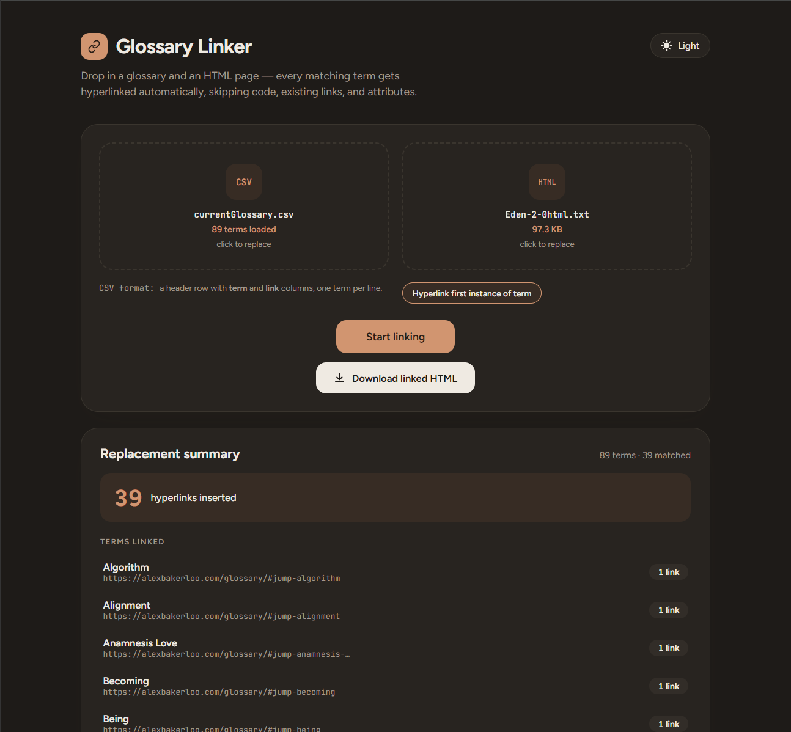

# Glossary Linker

A browser-based tool that automatically hyperlinks glossary terms found in an HTML page.

Drop in a CSV glossary (term + link pairs) and an HTML page, and Glossary Linker scans the page text and wraps matching terms in links to their glossary entries, while skipping code blocks, existing links, and HTML attributes so it never breaks the page. You can choose whether to link every occurrence or only the first occurrence of each glossary term. The result can be downloaded as a ready-to-use HTML file, along with a summary of what was linked, what wasn't matched, and any skipped rows.

## Features

- **CSV glossary upload** — expects a header row with `term` and `link` columns.
- **HTML page upload** — accepts `.html`, `.htm`, or `.txt` files.
- **Drag-and-drop or click-to-browse** for both inputs.
- **Match mode toggle** — switch between **Hyperlink every matching term** and **Hyperlink first instance of term**.
- **Smart matching** — matches plural forms of terms and avoids linking inside existing `<a>` tags, code/script content, or HTML attributes.
- **Replacement summary** — shows matched terms with counts, unmatched terms, and any skipped glossary rows.
- **Download** — outputs the linked HTML as a downloadable file.
- **Light/dark theme toggle.**



## Requirements

- [Node.js](https://nodejs.org/) (with npm)

## Running the program

1. Install dependencies:

   ```
   npm install
   ```

2. Start the development server:

   ```
   npm run dev
   ```

3. Open the URL Vite prints (typically `http://localhost:5173`) in your browser.

4. Drop your glossary CSV and HTML page into the two upload zones.

5. (Optional) Use the mode toggle beside the CSV format hint to choose how replacements work:
   - **Hyperlink every matching term**: links all occurrences of each glossary term.
   - **Hyperlink first instance of term**: links only the first occurrence of each glossary term across the whole HTML file.

6. Click **Start linking**, then **Download linked HTML** to save the result.

### Other scripts

- `npm run build` — type-checks and builds a production bundle (output in `dist/`).
- `npm run preview` — serves the production build locally for a final check.

## CSV format

A header row followed by one term per line:

```csv
term,link
API,https://example.com/glossary/api
Latency,https://example.com/glossary/latency
```
